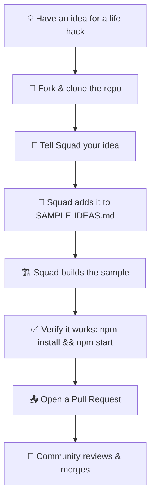

# Contributing to 100 Ways to Use Squad

Welcome! This is a community-driven project where anyone — whether you're a coder or not — can contribute real-world examples of life automation using Squad.

## The Vision

You don't need to write code yourself. You bring **an idea**, and the **Squad writes the code for you**. Our agent team will build, test, and ship your sample. You just need curiosity, an idea, and the willingness to collaborate with AI.

## Prerequisites

Before you start, make sure you have:

- **GitHub account** — Free at [github.com](https://github.com)
- **GitHub Copilot CLI** — Install from the [GitHub Copilot CLI docs](https://github.com/github-copilot/copilot-cli)
- **Node.js 20+** — Download at [nodejs.org](https://nodejs.org)
- **Git basics** — Know how to fork, clone, branch, and open pull requests

## Contribution Workflow



## Step-by-Step Walkthrough

### 1. Fork and Clone

1. Go to [100-ways-to-use-squad](https://github.com/bradygaster/100-ways-to-use-squad)
2. Click **Fork** in the top right
3. Clone your fork locally:
   ```bash
   git clone https://github.com/YOUR-USERNAME/100-ways-to-use-squad.git
   cd 100-ways-to-use-squad
   ```

### 2. Create a Feature Branch

```bash
git checkout -b squad/YOUR-IDEA-NAME
```

For example: `squad/meal-prep-planner` or `squad/household-budget-helper`

### 3. Start a Squad Session

From the repo root:

```bash
cd .
copilot squad
```

This opens a Squad session where you can describe your idea in plain English.

### 4. Example Conversation with Squad

```
You: I want to build a sample that helps me plan my weekly meal prep. 
     I give it what's on sale at my grocery store this week, 
     and it suggests which meals to make so I minimize waste and save money.

Squad: Great idea! This is meal-prep optimization — perfect for demonstrating 
       multi-agent planning. I'll build a sample that:
       1. Takes your grocery deals as input
       2. Suggests recipes that use those ingredients
       3. Plans which meals to prep each day
       4. Calculates cost savings vs buying takeout
       
       I'm marking this in SAMPLE-IDEAS.md and building the sample directory...
```

### 5. What Squad Does

The Squad will:
- Update `SAMPLE-IDEAS.md` — mark your idea as 📋 (planned) then ✅ (shipped)
- Create a new sample directory with your sample name
- Build a complete TypeScript project with:
  - `package.json` with dependencies
  - `tsconfig.json` with strict type checking
  - `squad.config.ts` describing the agent team
  - Clean, working code that runs out of the box
  - Sample data so it works immediately

### 6. Test Your Sample

Once Squad finishes building:

```bash
cd YOUR-SAMPLE-NAME
npm install
npm start
```

Verify it works. If something's broken, report it back to Squad and they'll fix it.

### 7. Commit and Push

```bash
git add .
git commit -m "Add meal-prep-planner sample"
git push origin squad/YOUR-IDEA-NAME
```

### 8. Open a Pull Request

1. Go to the main repo: [100-ways-to-use-squad](https://github.com/bradygaster/100-ways-to-use-squad)
2. Click **New Pull Request**
3. Select your fork and branch
4. Add a description of what your sample does and why it's useful
5. Submit!

The community will review, ask questions, and merge. 🎉

## Sample Requirements

For your idea to become a sample, it must:

1. **Be standalone** — Its own `package.json`, `tsconfig.json`, and `squad.config.ts`
2. **Use @bradygaster/squad-sdk** — Built with Squad agents, not just a script
3. **Solve a real problem** — Something you or your friends would actually use
4. **Run out of the box** — `npm install && npm start` with no API keys or secrets needed
5. **Have sample data** — Include demo data so people can see it working immediately
6. **Pass type checking** — `npx tsc --noEmit` with no errors
7. **Be different** — Show a pattern we haven't covered yet (new interaction style, new domain, new algorithm)

## What Makes a Good Sample Idea?

The best ideas:

- **Automate something tedious** — Meal planning, budget tracking, calendar optimization, job hunting, email triage
- **Show agent collaboration** — Multiple agents working together, not just one agent doing everything
- **Are relatable** — Your friends and family understand why it's useful without explanation
- **Demonstrate a new pattern** — Maybe it uses Playwright for web automation, or CSV file analysis, or API integration
- **Fit real life** — It solves something people do weekly or daily

### Examples of Good Ideas

- "Help me pack for trips by suggesting items based on destination weather and trip length"
- "Analyze my utility bills and recommend which appliances to replace for savings"
- "Generate a weekly meal plan that uses what I already have and minimizes grocery waste"
- "Track my job applications and send me weekly summaries of follow-ups I should make"
- "Monitor real estate listings in neighborhoods I like and alert me when something fits my criteria"

### Examples of Ideas That Don't Fit

- "Just run some Python code" — needs to use Squad agents
- "Call an external API that requires a secret key" — should work without API keys for demos
- "The exact same algorithm as another sample" — should show something new

## Code of Conduct

Be kind. Be helpful. Have fun automating your life. We're building this together, and that means:

- Ask questions if something's unclear
- Help other contributors debug their ideas
- Celebrate wins
- Give feedback that's constructive, not critical

## Questions?

If you get stuck:

1. Check existing samples to see how they're structured
2. Ask Squad directly in your session
3. Open an issue on the repo with your question

Let's build something cool! 🚀
